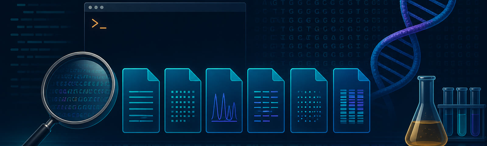

# 🧬 El caso de las muestras sin etiqueta

Una falla borró las extensiones de seis archivos bioinformáticos. Los datos están intactos, pero el laboratorio necesita reconstruir el lote antes de continuar.

> 🎯 **Tu misión:** identificar los formatos, ordenar las muestras, recuperar genes de resistencia y resolver el caso con BLAST.

## 🧭 Cómo jugar

1. Abrí **1_FORMATOS** y avanzá en orden hasta **4_BLAST**.
2. Ejecutá los comandos en la terminal.
3. Al final de cada misión, consultá tu avance con `python3 verificar.py N`.
4. Si te trabás, abrí **PISTAS** y revelá una ayuda por vez.

La solapa **5_BONUS_PYTHON** es opcional.

> 🖥️ **Prepará tu espacio de trabajo**
>
> Podés minimizar la terminal mientras leés y volver a abrirla cuando necesites ejecutar comandos. Para aprovechar mejor la pantalla, usá el navegador en pantalla completa (`F11`) y ajustá el zoom con `Ctrl` + `+` o `Ctrl` + `-`.

**¿Todo listo? Abrí `1_FORMATOS` y empezá la investigación.** 🔎
